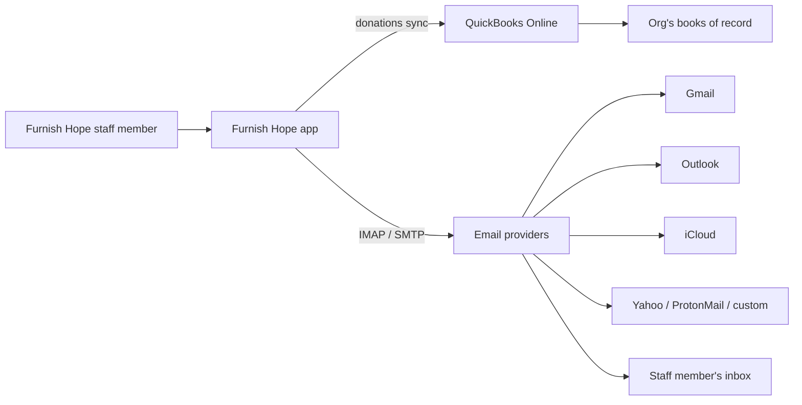

# Furnish Hope — Third-party Integrations

Furnish Hope connects to a small number of outside services to reduce
double-entry and let staff work from their normal tools. This page
lists every integration the app supports, with a link to the
step-by-step setup guide.

## Active integrations

| Service | What it does | Setup guide |
|---------|--------------|-------------|
| **QuickBooks Online** | Pushes recorded donations to QBO as Sales Receipts so the bookkeeper doesn't re-enter them. Maps each Furnish Hope fund to a QBO income account. Donor records auto-link to QBO customers on first sync. | [Set up QuickBooks](INTEGRATION_QUICKBOOKS.md) |
| **Email — Gmail** | Connect a staff Gmail inbox to send receipts, record sent messages, and pull replies into the Mailbox view. Two options: classic app password OR one-click Google Sign-in. | [Set up Email](INTEGRATION_EMAIL.md#gmail) |
| **Email — iCloud** | Same as Gmail but for iCloud / @me.com / @mac.com addresses. App-specific password required (Apple doesn't offer OAuth for third-party clients). | [Set up Email](INTEGRATION_EMAIL.md#icloud) |
| **Email — Outlook / Microsoft 365** | One-click Microsoft Sign-in is the **only** supported method — Microsoft killed plain-password IMAP. | [Set up Email](INTEGRATION_EMAIL.md#outlook) |
| **Email — Yahoo** | App password required. Yahoo's "third-party app password" feature lives in account security settings. | [Set up Email](INTEGRATION_EMAIL.md#yahoo) |
| **Email — ProtonMail** | Requires ProtonMail's IMAP Bridge running on the staff member's computer. Best supported for staff with technical comfort. | [Set up Email](INTEGRATION_EMAIL.md#protonmail) |
| **Email — Custom IMAP** | Any other email host (work email at a small ISP, university account, etc.) with IMAP and SMTP. Manual host/port entry. | [Set up Email](INTEGRATION_EMAIL.md#custom-imap) |

## Architecture at a glance

Two things are worth calling out:

- **Donations sync to QBO** is org-wide. There's one connection per
  organization, set up by an admin. After that, every donation can
  push to QBO with one click.
- **Email accounts are per-user.** Each staff member connects their
  OWN inbox. The Mailbox view shows only the signed-in user's mail —
  no shared inboxes, no cross-staff visibility.

## Not yet integrated

These services were considered or are sometimes asked about but
**are NOT currently connected**. The in-app feature listed exists
as a Furnish Hope feature, but doesn't sync with any outside service.

| Service | In-app feature today | Why not integrated |
|---------|----------------------|-------------------|
| **Google Calendar / iCal / Outlook Calendar** | The in-app **Calendar** (Operations → Calendar) shows pickups, deliveries, visits, events, and shifts. | Internal-only — no two-way sync with any external calendar. Adding it would mean an OAuth flow + sync engine similar to email. Open as a feature request if needed. |
| **DigitalOcean Spaces / Amazon S3 / Google Drive** for file attachments | Files attached to donors, clients, etc. via the Attachments widget. | Scaffolded — the database supports multiple storage providers, but only the `pg_blob` (Postgres-backed) provider is wired up today. Moving blobs to S3 / Spaces would offload storage cost on a large mailbox; not urgent. |
| **Twilio / SMS** for container-pickup codes | Container-pickup notifications: Furnish Hope records that staff shared a lock code with the client by email, phone, or SMS. | Staff sends the message manually using their own tools; the app records that it was sent. Real SMS would need a Twilio account (~$6–10/month at low volume). Open as a feature request. |
| **Stripe / payment processors** | Donations can be recorded (cash, check, credit card, etc.) but are entered manually after the fact. | No on-platform donation collection. Donors pay through whatever channel the org already uses (Stripe, PayPal, etc.); the receipt lands in QBO via this app's sync. |

## How to add a new integration

If you want to connect another outside service:

1. Open an issue using the **Report Issue** button in the app
   (top-right of any admin page) with a description of what the
   integration should do.
2. The developer evaluates feasibility (some integrations are a few
   days of work, some are a few weeks).
3. New integration → new doc here following the same template as
   the existing ones.

## Keeping these docs current

These integration guides are part of how Furnish Hope works — not
historical artifacts. They get updated in the same commit as any
change to:

- The connection flow (new buttons, new screens)
- Environment variables (e.g. new `QBO_*` or `*_OAUTH_*` keys)
- Provider behavior the app has to work around (Microsoft killing
  basic auth was the most recent example)
- Supported providers (adding or removing a preset)

If you follow a guide and something doesn't match the app, that's a
bug. Use the **Report Issue** button.
