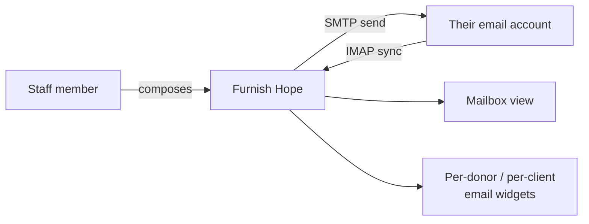

# Email — Setup Guide

How to connect a Furnish Hope staff member's email inbox so they can
send receipts, record sent messages, and pull replies into the
in-app Mailbox. **Written for non-technical nonprofit staff** — no
coding background assumed.

## What this gives you

When a staff member connects their email:

- **Sending** — Furnish Hope can send mail from their address
  (receipts, acknowledgements, replies, container-pickup codes).
- **Recording** — every sent message is stored in the app so other
  staff who view the same donor / client can see "Preston emailed
  this donor yesterday."
- **Receiving** — periodic IMAP sync pulls new inbound messages
  into the Mailbox view, where staff can reply inline.

Email is **strictly per-user**. The Mailbox page only shows the
signed-in user's mail. There's no shared inbox — every staff
member connects their own.

## Pick your provider

| Provider | Setup method | Section |
|----------|-------------|---------|
| **Gmail** (personal or Google Workspace) | Sign in with Google (recommended) OR app password | [Gmail](#gmail) |
| **iCloud** (@me.com, @icloud.com, @mac.com) | App-specific password | [iCloud](#icloud) |
| **Outlook / Microsoft 365 / Hotmail** | Sign in with Microsoft (the ONLY option) | [Outlook](#outlook) |
| **Yahoo Mail** | App password | [Yahoo](#yahoo) |
| **ProtonMail** | ProtonMail Bridge + app password | [ProtonMail](#protonmail) |
| **Anything else** (work email at a small ISP, university account, etc.) | Custom IMAP / SMTP host + port | [Custom IMAP](#custom-imap) |

## Where to connect

For every provider, the entry point is the same:

1. Sign in to Furnish Hope.
2. Sidebar → **Email → Accounts**.
3. Click **+ Connect account**.
4. Pick your provider from the dropdown.

What happens next depends on the provider. Each section below
covers one.

---

## Gmail

The recommended way to connect Gmail is **Sign in with Google**
(OAuth). You click one button, Google asks if it's OK, and you're
done — no passwords typed into Furnish Hope at all.

If Sign-in with Google isn't available (the green button is grey
or missing), your developer hasn't set up the org-wide OAuth app
yet — see [OAUTH_SETUP.md](OAUTH_SETUP.md) for that one-time admin
task. Fall back to **app password** below until they have.

### Option A: Sign in with Google (recommended)

1. Sidebar → **Email → Accounts** → **+ Connect account**.
2. Provider: **Gmail**.
3. Method: **Sign in with Google** (radio button).
4. Click **Continue with Google**.
5. Your browser is redirected to Google's sign-in page.
6. Pick the Google account you want to connect — usually the one
   already signed in.
7. Review the requested permissions:
   - Read, compose, send, and permanently delete all your email
     from Gmail
8. Click **Continue**.
9. Browser returns to Furnish Hope with the account showing as
   **Connected ✓**.

> **🛟 "This app isn't verified" yellow screen:** Google flags
> custom Workspace apps until they're submitted for verification.
> The screen reads "Advanced → Go to Furnish Hope (unsafe)". Click
> through; the warning is because the org is small, not because
> there's a real risk. The OAuth app belongs to your own
> organization, so it's fine.

### Option B: App password (works without OAuth setup)

Gmail's app passwords are 16-character keys you generate inside
your Google account that bypass 2-factor for specific apps.

> **⚠️ Requires 2-Step Verification.** If your Google account
> doesn't have 2-Step Verification on, turn it on first
> (myaccount.google.com → Security → 2-Step Verification → Get
> started). Without it, app passwords don't exist.

1. Open <https://myaccount.google.com/apppasswords> in a browser.
2. Sign in.
3. **App name:** type `Furnish Hope` (only seen by you).
4. Click **Create**.
5. Google shows you a 16-character password like `abcd efgh ijkl mnop`.
   **Copy it now** — Google won't show it again.
6. Back in Furnish Hope: Email → Accounts → **+ Connect account**.
7. Provider: **Gmail**. Method: **App password**.
8. Email: `you@gmail.com`. Password: paste the 16-char string
   (spaces optional).
9. Click **Test connection**.
   - You should see "✓ IMAP login OK" and "✓ SMTP login OK".
10. Click **Save**.

### What "Connected" looks like

The accounts list shows your address with a green dot. Click into
it to see:
- Last IMAP sync time
- Last sent test result
- Default-send toggle (if you connect more than one account, pick
  which one Furnish Hope uses for outgoing receipts)

---

## iCloud

Apple doesn't expose OAuth for third-party email clients, so the
only method is **app-specific password**.

### 1. Generate an app password

1. Open <https://appleid.apple.com/account/manage> in a browser.
2. Sign in to your Apple ID.
3. Under **App-Specific Passwords**, click **Generate
   Password…** or **+**.
4. Label: `Furnish Hope`.
5. Click **Create**. Apple shows you a 16-character password like
   `abcd-efgh-ijkl-mnop`. **Copy it.**

> **⚠️ Requires 2-Factor Authentication.** App-specific passwords
> require 2FA on your Apple ID. Without it, this option is hidden.

### 2. Connect in Furnish Hope

1. Email → Accounts → **+ Connect account**.
2. Provider: **iCloud**.
3. Email: your full iCloud address (`yourname@icloud.com`,
   `yourname@me.com`, or `yourname@mac.com` — whichever you
   actually use).
4. Password: paste the app-specific password (with hyphens).
5. Click **Test connection** → **Save**.

### Notes

- IMAP host: `imap.mail.me.com:993` (auto-filled, don't change).
- SMTP host: `smtp.mail.me.com:587` (auto-filled).
- If you have multiple aliases on the same iCloud account, you can
  only connect them one at a time — each as a separate account in
  Furnish Hope.

---

## Outlook

Microsoft killed plain-password IMAP/SMTP for personal Outlook and
365 accounts. The **only** way to connect is **Sign in with
Microsoft**.

If Sign-in with Microsoft isn't available (the blue button is grey
or missing), your developer hasn't set up the org-wide OAuth app
yet — see [OAUTH_SETUP.md](OAUTH_SETUP.md) for that one-time admin
task. You're blocked until they do.

### Sign in with Microsoft

1. Email → Accounts → **+ Connect account**.
2. Provider: **Outlook**.
3. Click **Continue with Microsoft**.
4. Your browser is redirected to Microsoft's sign-in page.
5. Sign in with the Outlook / 365 account you want to connect.
6. Review the requested permissions:
   - Read your mail
   - Send mail as you
   - Maintain access to data you have given it access to
7. Click **Accept**.
8. Browser returns to Furnish Hope with the account showing as
   **Connected ✓**.

### Notes

- Works for both personal Outlook (@outlook.com, @hotmail.com,
  @live.com) and Microsoft 365 work accounts.
- For 365 work accounts: your IT admin may need to approve the
  Furnish Hope OAuth app in Microsoft Entra (Azure AD) before
  you can sign in. If you get "Need admin approval" instead of
  the consent screen, forward the screen to your IT admin to
  approve.

---

## Yahoo

Yahoo offers app passwords (Yahoo calls them "third-party app
passwords") through account security settings.

### 1. Generate an app password

1. Open <https://login.yahoo.com/account/security> in a browser.
2. Sign in.
3. Click **Generate app password** (under "Other ways to sign
   in").
4. App name: `Furnish Hope`.
5. Click **Generate**. Yahoo shows a 16-character password — copy
   it.

> **⚠️ Requires 2-Step Verification.** Yahoo's app-password
> feature only appears if you have 2-Step Verification on.

### 2. Connect in Furnish Hope

1. Email → Accounts → **+ Connect account**.
2. Provider: **Yahoo**.
3. Email: your full Yahoo address.
4. Password: paste the app password.
5. Click **Test connection** → **Save**.

### Notes

- IMAP host: `imap.mail.yahoo.com:993` (auto-filled).
- SMTP host: `smtp.mail.yahoo.com:587` (auto-filled).

---

## ProtonMail

ProtonMail's IMAP/SMTP requires their **Bridge** app, which runs
on your computer and translates IMAP/SMTP traffic to ProtonMail's
encrypted internal protocol. This is the only setup that requires
software running on your own machine.

### 1. Install ProtonMail Bridge

1. Open <https://proton.me/mail/bridge> in a browser.
2. Sign in with your Proton account.
3. Download the Bridge for your OS (Windows / Mac / Linux) and
   run the installer.
4. Open the Bridge app. Sign in with your Proton account.
5. The Bridge shows your IMAP/SMTP credentials:
   - **IMAP host:** `127.0.0.1` (your own machine)
   - **IMAP port:** `1143` (usually)
   - **SMTP host:** `127.0.0.1`
   - **SMTP port:** `1025` (usually)
   - **Username:** your full Proton address
   - **Password:** a long Bridge-generated password — copy it

Keep the Bridge app running. It must be open whenever Furnish Hope
talks to your inbox.

### 2. Connect in Furnish Hope

1. Email → Accounts → **+ Connect account**.
2. Provider: **ProtonMail**.
3. Email: your Proton address.
4. Password: the Bridge password.
5. The IMAP and SMTP host/port fields are pre-filled with the
   Bridge values; adjust only if your Bridge shows different
   numbers.
6. **Important:** uncheck the "use SSL/TLS" boxes — Bridge uses a
   STARTTLS / unencrypted local connection.
7. Click **Test connection** → **Save**.

### Limitations

- The Furnish Hope app can only sync your Proton inbox **while the
  Bridge is running** on the machine you connect from. If you
  shut down your laptop, Furnish Hope's background sync silently
  fails until you start it back up.
- For staff who don't keep a computer always-on, ProtonMail isn't
  a great fit. Consider a Gmail / Outlook account for app-driven
  email instead, and use Proton for personal correspondence.

---

## Custom IMAP

For any provider not in the preset list (work email at a small ISP,
university account, hosted email at a domain registrar), use
**Custom IMAP**.

### What you need

From your email provider's documentation:

- **IMAP server hostname** (e.g. `mail.example.com`)
- **IMAP port** — usually `993` for SSL/TLS, `143` for STARTTLS
- **SMTP server hostname**
- **SMTP port** — usually `465` for SSL/TLS, `587` for STARTTLS
- **Username** — often the same as your email address, but
  sometimes just the part before the `@`
- **Password** — your account password, OR an app-specific
  password if the provider supports it

### Connect

1. Email → Accounts → **+ Connect account**.
2. Provider: **Custom IMAP**.
3. Fill in every field above.
4. Click **Test connection**.
   - Read any error message carefully — it'll usually tell you
     which step failed (wrong host, wrong port, wrong password).
5. **Save**.

---

## After connecting — daily use

### Send a message

1. Sidebar → **Email → Compose**.
2. To / Subject / Body — fill in as usual.
3. Optionally pick an **Email template** from the dropdown to
   pre-fill body text.
4. Click **Send**. The message goes out via SMTP and is recorded in
   Furnish Hope.

### Send a receipt for a donation

1. Open a donation's detail page.
2. Click **Send receipt**.
3. The app pre-fills a Compose form with the donor's email + the
   official receipt PDF attached.
4. Edit / add a personal note, click **Send**.

### See your mail

Sidebar → **Email → Mailbox**.

- The list shows inbox messages with unread (bold) and read.
- Click **Sync now** to pull new mail right away. Otherwise the app
  syncs every few minutes in the background.
- Click any message to expand the body and reply inline.
- The badge on the sidebar entry shows your unread count.

### Per-donor / per-client email history

When viewing a donor or client's detail page, the **Email** widget
on the right shows every message you've exchanged with that person
across all your connected accounts. Click in to read or reply.

This is per-user, not org-wide — you see YOUR messages with that
donor, not other staff's. (See the [User Manual's email section](../web/src/pages/help/index.tsx)
for the design rationale.)

---

## Troubleshooting

### "IMAP login OK" but "SMTP login failed"

The two services usually share credentials, but providers
occasionally allow IMAP and block SMTP for newly-issued tokens.

- Wait 5–10 minutes (some providers have a short delay).
- For Gmail with app password: make sure the app password is from
  the right Google account.
- For Outlook: the OAuth flow is unified — there's no separate
  IMAP/SMTP failure; the whole connection must succeed or fail.

### "Authentication failed" when both used to work

Most common cause: the provider rotated your token. App passwords
sometimes get invalidated by security events on the provider's
side.

- Generate a new app password and update the account in **Email →
  Accounts → Edit**.
- For OAuth (Gmail / Outlook): click **Reconnect** on the account
  card and re-do the consent flow.

### Messages aren't showing up after Sync

- Check **Email → Accounts** → look at the **Last sync** time and
  any **Error** message.
- The IMAP sync only pulls from INBOX and Sent folders. Mail filed
  into a sub-folder by a server-side rule won't appear in Furnish
  Hope's Mailbox.

### "Too many simultaneous connections" from the provider

Common with Gmail when multiple devices are syncing the same inbox.
Furnish Hope reuses connections aggressively, but if you see this:

- Disconnect a device or close a desktop mail client you don't use.
- Wait 5 minutes and click **Sync now** again.

### Sent messages don't appear in the Sent folder of my real inbox

Furnish Hope's Send pushes via SMTP, which doesn't automatically
copy to the IMAP Sent folder. The app does its best to APPEND the
sent message back to the provider's Sent folder after sending. If
this fails (some providers don't allow APPEND on the Sent folder),
the message is still SENT — it just won't show in your inbox's
Sent folder. Use Furnish Hope's Mailbox → Sent tab to see what
you've sent through the app.

---

## When this guide gets out of date

Email providers change their security models constantly (Microsoft
killing basic auth is the canonical recent example). If you follow
a step and what you see doesn't match what's written:

1. Use the **Report Issue** button in the running app (top-right
   of any admin page) with a screenshot.
2. Or open this file and submit a correction directly.

The list of supported providers, the connection flow, and provider
quirks are kept in sync with the app code — out-of-date
instructions are a real bug.
