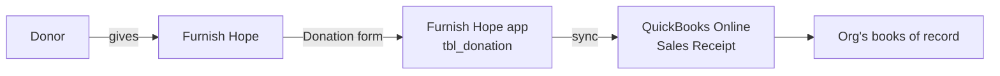
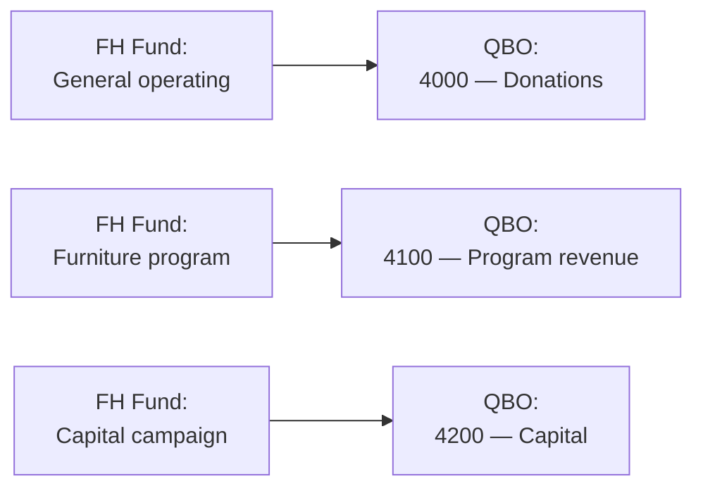

# QuickBooks Online — Setup Guide

How to connect Furnish Hope to QuickBooks Online (QBO) so recorded
donations flow into your books as Sales Receipts. **Written for
non-technical nonprofit staff** — no accounting or coding background
assumed.

## What this gives you

When a Furnish Hope staff member records a donation in the app, one
click pushes that donation to QuickBooks as a Sales Receipt — with
the donor matched to a QBO customer and each fund designation mapped
to the correct income account. The bookkeeper sees the same
transaction in QBO that staff entered in Furnish Hope, no
double-entry.

| What Furnish Hope sends to QBO | Where it lands |
|-------------------------------|----------------|
| Donation amount + date | Sales Receipt header |
| Donor name + contact info | QBO Customer (matched or created) |
| Fund designations (e.g. "Furniture program: $250") | Sales Receipt line items mapped to QBO income accounts |
| Payment method (cash / check / card / etc.) | Sales Receipt payment method |
| Receipt number | Sales Receipt doc number |

A "Sync to QBO" status appears on every donation detail page so you
can see at a glance whether each gift made it across.

## When this guide applies

- You're the **admin** who'll set up the QBO connection once for the
  whole organization.
- Or you're the **bookkeeper** who needs to confirm the mappings
  are right.
- Or you're **staff** wondering why the Sync button is greyed out
  on a donation (skip to [Daily use](#daily-use)).

## Roles in this setup

| Role | What they do |
|------|--------------|
| **Furnish Hope admin** | Sets up the QBO connection in the Furnish Hope app's admin panel. Maps Funds to QBO accounts. |
| **QBO admin / bookkeeper** | Gives the Furnish Hope admin access to the QBO account (or sets up a sandbox first if they want to test). Owns the actual accounting. |
| **Furnish Hope developer** | Sets the three QBO environment variables on the deployment ONE TIME during initial deployment. After that they don't need to touch QBO. |

---

## Part 1 — One-time developer setup (skip if your developer has already done this)

This part is done ONCE per organization, usually during the initial
DigitalOcean setup. If your Furnish Hope admin panel shows a
"**Connect QuickBooks**" button instead of a "**QuickBooks is not
configured on the server**" error, your developer has already done
this — skip to Part 2.

### 1.1 Create an Intuit Developer account

1. Open <https://developer.intuit.com> in a browser.
2. Click **Sign up** at the top right. Use the org's developer email
   (not a personal one — this account will own the app forever).
3. Confirm the email link Intuit sends.
4. Accept the developer terms.

### 1.2 Create the app

1. In the Intuit Developer dashboard, click **Dashboard → Create
   an app**.
2. App type: **QuickBooks Online and Payments**.
3. App name: `Furnish Hope` (or whatever the org prefers — only
   visible to admins authorizing the connection).
4. Select scopes:
   - ✅ **com.intuit.quickbooks.accounting** (required — donations sync
     uses the accounting API)
   - ❌ payments scope — not needed
5. Click **Create app**.

### 1.3 Find the keys and redirect URI

1. In the new app's dashboard, click **Keys & credentials**.
2. There are two environments: **Development** (sandbox, for
   testing) and **Production** (real QBO companies). You'll
   eventually want both.
3. For each environment you care about, copy:
   - **Client ID** — long alphanumeric string
   - **Client Secret** — also long alphanumeric
4. Under **Redirect URIs**, click **Add URI** and add:
   - For development: `http://localhost:4000/api/quickbooks/callback`
   - For production: `https://your-app.ondigitalocean.app/api/quickbooks/callback`
     (use the actual domain — see your DO app's URL)
5. Save.

### 1.4 Set the environment variables on the deployment

Set these three environment variables on your DigitalOcean App
Platform deployment (Settings → App-Level Environment Variables):

| Variable | Value | Encrypted? |
|----------|-------|------------|
| `QBO_CLIENT_ID` | The Client ID copied above | Yes |
| `QBO_CLIENT_SECRET` | The Client Secret copied above | Yes |
| `QBO_REDIRECT_URI` | Exactly the URL you added in 1.3 — must match character-for-character | No |
| `QBO_ENVIRONMENT` | `production` for real QBO companies, `sandbox` for testing | No |

Save. DO will redeploy automatically; takes ~3 minutes.

> **🛟 To test locally first:** set the same variables in
> `api/.env` with the **sandbox** values, and the redirect URI
> at `http://localhost:4000/api/quickbooks/callback`. Run the API
> normally (`npm run dev`).

---

## Part 2 — Connect QuickBooks (one-time admin setup)

This is what the Furnish Hope admin does once per org to authorize
the app to talk to QBO.

### 2.1 Make sure you have the right QBO access

You need to be an admin of the QuickBooks Online company you want
to sync to. If you're not, ask your bookkeeper to either:

- Grant you admin access to that company (Settings → Manage
  Users → Add User → admin role), OR
- Do the connection flow themselves; they'll see the same screens.

### 2.2 Open the QuickBooks settings page in the app

1. Sign in to Furnish Hope as an admin.
2. Sidebar → **System → QuickBooks**.

You'll see one of:

| What you see | Means |
|-------------|-------|
| "QuickBooks is not configured on the server. Set QBO_CLIENT_ID, QBO_CLIENT_SECRET, and QBO_REDIRECT_URI environment variables." | Part 1 wasn't done. Loop in your developer. |
| A "Not connected" card with a green **Connect QuickBooks** button | Ready to connect. Continue with 2.3. |
| A "Connected to **Company Name**" card with mapping options below | Someone already connected. If you want to switch companies, click **Disconnect** first. |

### 2.3 Click Connect QuickBooks

1. Click the green **Connect QuickBooks** button.
2. Your browser is redirected to Intuit's authorization page.
3. **Sign in** with the QuickBooks credentials for the company you
   want to sync.
4. **Pick the company** if your QBO login has access to multiple.
5. Review the permission request:
   > Furnish Hope is requesting access to your QuickBooks data
   > (read & write accounting data).
6. Click **Connect**.
7. Your browser is redirected back to Furnish Hope. You should see
   a green confirmation banner:
   > ✓ Connected to QuickBooks. Company: **Your Org Name**.
   > Map funds below before syncing donations.

### 2.4 Map your Funds to QBO income accounts

This is the critical step. Furnish Hope can't sync a donation until
every fund the donation touches has a QBO account on the other side.

A "Fund" is Furnish Hope's accounting bucket (General operating,
Furniture program, Capital campaign, etc. — see `lkp_fund` in the
Database Admin). A "QBO account" is your chart-of-accounts income
account in QuickBooks.

On the QuickBooks settings page, scroll to the **Fund mappings**
section. For each Fund you use:

1. Click the dropdown next to the Fund name.
2. Pick the matching QBO income account.
3. Save.

> **🛟 If the QBO account list is empty:** Furnish Hope hasn't been
> able to fetch your chart of accounts yet. Click **Refresh
> accounts**; if still empty, check that the QBO user you connected
> as has the `Accountant` or `Admin` role on the QBO company.

### 2.5 Set the deposit account and undesignated account

In the same settings area:

- **Deposit account** — the QBO bank or "Undeposited Funds" account
  where donations land. Required for Sales Receipts to balance.
- **Undesignated income account** — used for donations that don't
  have a fund designation (rare; typical for cash gifts where the
  donor said "wherever it's needed").

Both are picked from dropdowns of accounts pulled from QBO.

### 2.6 Choose auto-sync vs manual sync

A toggle controls whether new donations sync automatically:

- **Auto-sync ON** — every donation saves AND pushes to QBO in one
  step. Use this once you're confident the mappings are right.
- **Auto-sync OFF** (default) — donations save in Furnish Hope only;
  staff clicks **Sync to QBO** on each donation when ready. Safer
  during initial rollout.

---

## Part 3 — Daily use

### Recording a donation that syncs to QBO

1. Sidebar → **Fundraising → Donations** → **+ New donation**.
2. Fill in the donation as normal — donor, amount, date, payment
   method, fund designations.
3. Click **Save**.
4. On the donation's detail page, look for the **QBO sync** widget
   on the right side:

   | Status | What it means | What to do |
   |--------|--------------|------------|
   | **Not synced** | Donation only exists in Furnish Hope | Click **Sync to QBO** |
   | **Pending** | Sync is in progress | Wait a few seconds, refresh |
   | **Synced ✓** | Sales Receipt exists in QBO; link shown | Done. Click the link to open it in QBO. |
   | **Failed ✗** | Sync attempted but errored | Click **Retry** after fixing the error (most common: missing fund mapping) |

5. To verify in QBO: click the link next to the sync status, or
   sign in to QBO and look in **Sales → Receipts**. The donor
   name + date + amount should match.

### Viewing all sync activity

Sidebar → **Fundraising → Donations → Acknowledgements** is one
view of recent gifts. To filter by sync status, use the **QBO sync**
filter chips at the top:

- **All** — every donation
- **Not synced** — donations that haven't been pushed
- **Synced** — donations confirmed in QBO
- **Failed** — donations whose last sync attempt errored (need
  attention)

### What gets synced when a donor exists in both systems

The first time a Furnish Hope donor is synced, the app looks for a
matching QBO customer by display name. If it finds one, it links
them; if not, it creates a new customer in QBO from the donor's
name + email + address.

You can also pre-link a donor manually:

1. Open the donor's detail page in Furnish Hope.
2. Click **QBO link** (if your developer has wired up the UI for
   it; otherwise this happens automatically on first sync).

---

## Part 4 — Troubleshooting

### "Sync to QBO" button is greyed out

One of these is true:

- The donation has no fund designations AND no `undesignated
  income account` is mapped. Either add designations or set the
  undesignated account (Part 2.5).
- Your QBO connection has expired. Go to **System → QuickBooks**.
  If the card shows "Disconnected" with a red banner, click
  **Reconnect**. QBO refresh tokens last ~100 days; reconnecting
  is one click.

### "Failed to start QuickBooks connection" when clicking Connect

Your developer didn't set the three QBO environment variables (or
set them wrong). Check the API logs for the line:

> QuickBooks is not configured on the server. Set QBO_CLIENT_ID,
> QBO_CLIENT_SECRET, and QBO_REDIRECT_URI environment variables.

Loop in your developer.

### "Redirect URI mismatch" during the OAuth flow

The redirect URI you set in the Intuit Developer console (Part 1.3)
must match `QBO_REDIRECT_URI` EXACTLY — same protocol (`http://` vs
`https://`), same host, same path, no trailing slash. The most
common cause is `https://...` in DO but `http://...` in the
Intuit console (or vice versa).

Fix on the Intuit side: developer.intuit.com → your app → **Keys
& credentials** → edit the URI. Save and retry.

### A specific donation failed to sync

Click into the failed sync entry to see the QBO error message. Most
common ones:

| QBO error | Cause | Fix |
|-----------|-------|-----|
| `Required parameter Account is missing for sync line item` | A fund designation has no QBO mapping | Go to **System → QuickBooks** and map the fund (Part 2.4) |
| `An entity with this name already exists` | Duplicate donor by display name in QBO | Manually link the donor to the existing QBO customer, or rename one of them slightly |
| `Authentication failed` | Access token expired and refresh failed | Click **Reconnect** in **System → QuickBooks** |
| `Invalid Reference Id` | The deposit account or undesignated account no longer exists in QBO (someone deleted or merged it) | Re-pick a valid account in **System → QuickBooks** |

After fixing, click **Retry** on the donation's QBO sync widget.

### I want to test without affecting real books

Use the **sandbox** environment:

1. In Intuit Developer, your app has a separate sandbox section.
2. Set `QBO_ENVIRONMENT=sandbox` on your local `.env` (NOT
   production).
3. The sandbox QBO company is at <https://app.sandbox.qbo.intuit.com>.
4. Connect Furnish Hope to the sandbox the same way as Part 2.

When you're confident, swap `QBO_ENVIRONMENT` to `production` and
re-connect to the real company.

### How to disconnect

1. Sidebar → **System → QuickBooks**.
2. Click **Disconnect**.
3. Confirm the popup.

Disconnecting:
- Stops new donations from syncing
- Leaves previously-synced donations in QBO untouched
- Forgets the OAuth token (so the next "Connect" starts fresh)
- Does NOT delete the fund mappings (they'll re-apply when you
  reconnect to the same company)

---

## What's stored where

For developers maintaining this integration:

| Table | What's in it |
|-------|--------------|
| `tbl_quickbooks_connection` | The active OAuth tokens (access + refresh, both encrypted). Only one row with `is_active=true` at a time. |
| `tbl_quickbooks_account_mapping` | Fund → QBO account mappings. One row per FH `lkp_fund` row. |
| `tbl_quickbooks_donor_link` | FH donor ↔ QBO customer mapping. Auto-created on first sync. |
| `tbl_quickbooks_donation_sync` | History of every sync attempt with status, timestamp, error message, payload summary. |
| `tbl_donation.qbo_*` columns | Denormalized "last sync" status + ID for list views. |
| `tbl_app_setting.qbo_*` keys | Defaults — `qbo_auto_sync_donations`, `qbo_default_payment_method_id`, `qbo_default_deposit_account_id`, `qbo_undesignated_account_id`. |

The OAuth refresh logic runs lazily — when an API call returns
401, the refresh token is used to get a new access token and the
call retries once. If the refresh token itself has expired, the
sync is marked failed with a "Reconnect required" error.

---

## When this guide gets out of date

If you follow a step and what you see doesn't match the app:

1. Use the **Report Issue** button in the running app (top-right
   of any admin page) with a screenshot.
2. Or open this file and submit a correction.

This guide is updated alongside any change to the QBO integration,
so out-of-date instructions are a real bug.
