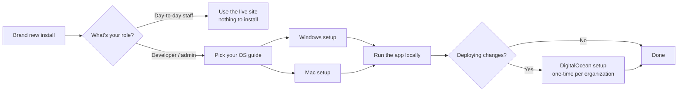
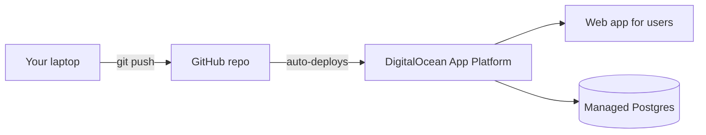

# Furnish Hope — Setup Guide

This is the entry point for setting up Furnish Hope. Pick the guide
that matches what you're trying to do:

| Goal | Guide |
|------|-------|
| **Get a live website running** for staff to use day-to-day on the
  internet | [DigitalOcean Production Setup](SETUP_DIGITAL_OCEAN.md) |
| **Set up your Windows laptop** so you can make changes to the app
  and test them locally | [Windows Developer Setup](SETUP_DEV_WINDOWS.md) |
| **Set up your Mac** so you can make changes to the app and test them
  locally | [Mac Developer Setup](SETUP_DEV_MAC.md) |

You don't need to set up everything. Here's the typical sequence:



## What is Furnish Hope?

A web app for a Central-Oregon nonprofit that pairs donated furniture
with families in need. The app has three "shells":

- **Staff shell** (the main app) — used by Furnish Hope employees and
  volunteers for everything: clients, donations, deliveries, reports.
- **Agency caseworker shell** — a trimmed-down portal for partner
  agencies to refer households without seeing internal data.
- **Public volunteer signup form** — anyone on the internet can
  apply to volunteer; admins review applications.

## What's in the code

```
furnish-hope/
├── api/              ← The back-end (Node + Express + PostgreSQL)
├── web/              ← The front-end (React + Vite + Tailwind)
├── db/               ← Initial schema and seed data
├── docs/             ← Documentation (you're reading one of these)
├── scripts/          ← Helper scripts (ERD generator, etc.)
└── .do/              ← DigitalOcean deployment configuration
```

## How the live deployment works



The workflow is: edit code on your laptop → push to GitHub →
DigitalOcean rebuilds the app automatically in 3–5 minutes. Users
hit a single URL; the back-end and front-end are bundled together.

## Where to get help

- **In the app:** click **Help** in the top-right of any page to open
  the User Manual at the matching section.
- **About the database design:** open the
  [ERD PDF](FurnishHopeERD.pdf) — every table grouped by theme with
  primary keys, foreign keys, and arrows between related tables.
- **About deployment specifically:** [DEPLOY.md](../DEPLOY.md)
  (developer-flavored, more concise).
- **About regenerating the database diagram after a schema change:**
  [REGENERATE_ERD.md](REGENERATE_ERD.md).
- **In code:** every long file starts with a comment explaining what
  it does. Search for `/**` at the top of each file.

## Keeping these guides current

The setup guides linked here are part of how Furnish Hope works — not
historical artifacts. They get updated in the same commit as any
change to install steps, runtime requirements, the deployment
process, or environment variables.

If you follow a guide and something doesn't match reality, that's a
bug — file an issue using the **Report Issue** button in the app's
top-right corner, or open the relevant guide and submit a fix.
