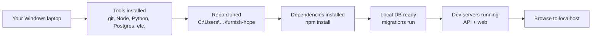
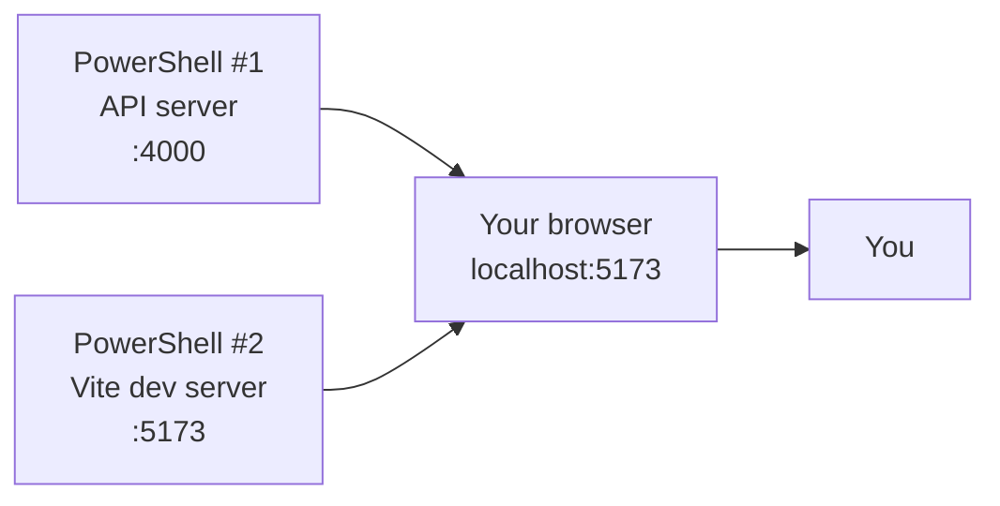

# Windows Developer Setup

Complete instructions for getting Furnish Hope running on a Windows
PC so you can make changes to the app and test them locally before
deploying. **Written for non-technical staff** — no coding background
assumed. Every step shows what to click, what to paste, and what
you should see.

---

## ⚡ New-laptop quickstart (the impatient version)

If you've done this before and just need the commands, here's the whole
thing in 8 steps. Each is detailed below if you get stuck.

```powershell
# 1. Install tools (admin UAC will pop a couple times)
winget install --id Git.Git -e --silent --accept-source-agreements --accept-package-agreements
winget install --id OpenJS.NodeJS.LTS -e --silent --accept-source-agreements --accept-package-agreements
winget install --id Python.Python.3.12 -e --silent --accept-source-agreements --accept-package-agreements
winget install --id PostgreSQL.PostgreSQL.16 -e --silent --accept-source-agreements --accept-package-agreements
winget install --id Microsoft.VisualStudioCode -e --silent --accept-source-agreements --accept-package-agreements

# 2. CLOSE PowerShell and OPEN A NEW ONE so the new commands are on PATH.

# 3. Confirm the Postgres password is `postgres` (reset if the installer set anything else)
& "C:\Program Files\PostgreSQL\16\bin\psql.exe" -U postgres -c "ALTER USER postgres WITH PASSWORD 'postgres';"

# 4. Identify yourself to git
git config --global user.name "Preston Mitchell"
git config --global user.email "preston@getreality.com"

# 5. Clone + enter the repo
cd C:\Users\$env:USERNAME
git clone https://github.com/BendOregonGuy/furnish-hope.git
cd furnish-hope

# 6. Create DB + load schema + seed
& "C:\Program Files\PostgreSQL\16\bin\psql.exe" -U postgres -c "CREATE DATABASE furnish_hope;"
& "C:\Program Files\PostgreSQL\16\bin\psql.exe" -U postgres -d furnish_hope -f db\01_schema.sql
& "C:\Program Files\PostgreSQL\16\bin\psql.exe" -U postgres -d furnish_hope -f db\02_seed.sql

# 7. Install deps + copy the env template
cd api;   npm install;   Copy-Item .env.example .env;   cd ..
cd web;   npm install;                                  cd ..

# 8. Run the app (TWO PowerShell windows side-by-side)
#    Window 1:  cd api;  npm run dev
#    Window 2:  cd web;  npm run dev
#    Browser:   http://localhost:5173
#    Look at window 1 for the initial admin password printed in a banner.
```

That's it. The full step-by-step below covers what each command does,
what you should see, and how to recover from each thing that can go
wrong.

---

## What you'll have when you're done

- The full Furnish Hope code on your laptop
- A local database with the same structure as production
- A local copy of the app running at `http://localhost:5173`
- Everything you need to make changes, test them, and push them live



## How long it takes

**45–75 minutes** the first time. After that, opening the app each
day is just two commands.

---

## Before you start

You need these things ready:

1. **Admin access** to your Windows laptop (you'll be installing
   software; some installers ask for permission).
2. **A GitHub account** with access to the Furnish Hope repository.
3. **About an hour** of uninterrupted time.
4. **About 2 GB of free disk space.**

---

## Part 1 — Open PowerShell

PowerShell is the black window where you'll paste most of these
commands. You'll use it dozens of times — get comfortable opening it.

1. Press the **Windows key** on your keyboard.
2. Type `powershell` (no quotes, no spaces).
3. Press **Enter**.

A black window with a blinking cursor opens. The prompt looks like
`PS C:\Users\Preston>`. Leave this open.

> **🖼️ What you'll see:** A black window labeled "Windows
> PowerShell" or "PowerShell 7" with white text. Don't be afraid
> of it — you can close it any time and the work you've done is
> saved on disk.

> **🛟 You can have multiple PowerShell windows open.** Later we'll
> need two running at the same time. To open a second one, just
> repeat the steps above.

---

## Part 2 — Install the tools (one-time, 30 min)

Each tool installs independently. If something fails mid-way, you
can pick up where you left off.

### 2.1 Install Git (5 min)

Git is the tool that downloads code from GitHub and uploads your
changes back.

Paste this command in PowerShell:

```powershell
winget install --id Git.Git -e --silent --accept-source-agreements --accept-package-agreements
```

Wait until you see `Successfully installed`. Then **close
PowerShell and open a NEW one** (Win key → "powershell" → Enter)
so the system picks up the new `git` command.

Confirm Git works:

```powershell
git --version
```

You should see `git version 2.x.x`.

### 2.2 Install Node.js (5 min)

Node.js runs JavaScript on your computer. Furnish Hope's back-end
is written in Node.

```powershell
winget install --id OpenJS.NodeJS.LTS -e --silent --accept-source-agreements --accept-package-agreements
```

Wait for `Successfully installed`. Close and reopen PowerShell.

Confirm:

```powershell
node --version
npm --version
```

You should see Node `v22.x.x` (or higher) and npm `10.x.x` (or
higher).

> **⚠️ Important:** Furnish Hope pins Node to version 22. If you
> install Node 20 or older, the build will warn or fail. If `node
> --version` shows 20.x, uninstall via Windows Settings → Apps,
> then re-run the winget command above.

### 2.3 Install Python (5 min)

Python is only used by the ERD-regeneration script. You won't run
Python every day, but the install is quick and needed for the
optional schema-diagram tool.

```powershell
winget install --id Python.Python.3.12 -e --silent --accept-source-agreements --accept-package-agreements
```

Wait, then close and reopen PowerShell.

Confirm:

```powershell
python --version
pip --version
```

Expect `Python 3.12.x` and a pip version line.

### 2.4 Install PostgreSQL (10 min)

PostgreSQL is the database. The local install lets you test data
changes without touching production.

```powershell
winget install --id PostgreSQL.PostgreSQL.16 -e --silent --accept-source-agreements --accept-package-agreements
```

The installer takes a few minutes. It will pop a Windows UAC dialog
asking for admin permission — click **Yes**.

When `Successfully installed` appears, confirm:

```powershell
& "C:\Program Files\PostgreSQL\16\bin\psql.exe" --version
```

You should see `psql (PostgreSQL) 16.x`.

**Set the default password.** During install, PostgreSQL prompts
for the `postgres` user's password through a separate console
window. The expected value is just `postgres` — easy to remember
for local dev. If you missed the prompt or set a different
password, reset it:

```powershell
& "C:\Program Files\PostgreSQL\16\bin\psql.exe" -U postgres -c "ALTER USER postgres WITH PASSWORD 'postgres';"
```

(It will ask for the current password; type whatever you set, then
press Enter.)

### 2.5 Install VS Code (5 min, optional but recommended)

Visual Studio Code is a code editor. You CAN edit Furnish Hope's
files in Notepad, but VS Code makes it easier (syntax highlighting,
file search, etc.).

```powershell
winget install --id Microsoft.VisualStudioCode -e --silent --accept-source-agreements --accept-package-agreements
```

After install, you can open the project in VS Code with:

```powershell
code C:\Users\<your-username>\furnish-hope
```

### 2.6 Install Graphviz (5 min, optional)

Only needed if you want to regenerate the entity-relationship
diagram. Detailed in [REGENERATE_ERD.md](REGENERATE_ERD.md). Quick
install:

```powershell
winget install --id Graphviz.Graphviz --source winget -e --silent --accept-source-agreements --accept-package-agreements
```

### 2.7 Install Pandoc + wkhtmltopdf (5 min, optional)

Only needed if you want to regenerate the codebase summary PDF
(`docs/CodebaseSummary.pdf`) via
`python scripts/generate_codebase_summary_pdf.py`. Skip if you're
just running the app.

```powershell
winget install --id JohnMacFarlane.Pandoc -e --silent --accept-source-agreements --accept-package-agreements
winget install --id wkhtmltopdf.wkhtmltox -e --silent --accept-source-agreements --accept-package-agreements
```

The Python script also uses the `psycopg2-binary` package to read
fresh DB stats:

```powershell
pip install psycopg2-binary
```

---

## Part 3 — Clone the repo (5 min)

Now download the actual Furnish Hope code from GitHub.

### 3.1 Sign in to GitHub on your computer

The first time Git tries to push code to GitHub, it'll ask for your
credentials. To save trouble, sign in now:

```powershell
git config --global user.name "Your Name"
git config --global user.email "you@example.com"
```

Use your real name and the email tied to your GitHub account.

### 3.2 Clone the code

Decide where the code should live. The standard location is
`C:\Users\<your-username>\furnish-hope`. Run:

```powershell
cd C:\Users\$env:USERNAME
git clone https://github.com/BendOregonGuy/furnish-hope.git
cd furnish-hope
```

The first time you talk to GitHub, your browser opens to sign you
in via a "GitHub Desktop / Browser" pop-up. Sign in normally; the
window closes itself and Git remembers you.

Confirm the code is on disk:

```powershell
ls
```

You should see folders named `api`, `web`, `db`, `docs`, `scripts`,
and so on — the same tree shown in [SETUP.md](SETUP.md).

---

## Part 4 — Set up the database (10 min)

### 4.1 Create the empty database

```powershell
& "C:\Program Files\PostgreSQL\16\bin\psql.exe" -U postgres -c "CREATE DATABASE furnish_hope;"
```

You should see `CREATE DATABASE`.

### 4.2 Load the schema

The schema is the structure of all the tables. It lives in
`db/01_schema.sql`.

```powershell
& "C:\Program Files\PostgreSQL\16\bin\psql.exe" -U postgres -d furnish_hope -f db\01_schema.sql
```

You'll see a flood of `CREATE TABLE`, `ALTER TABLE`, etc. lines.
That's normal.

### 4.3 Load the seed data (optional but recommended)

The seed data fills the database with realistic-looking sample
records (donors, clients, etc.) so the app isn't empty when you
first open it.

```powershell
& "C:\Program Files\PostgreSQL\16\bin\psql.exe" -U postgres -d furnish_hope -f db\02_seed.sql
```

> **⚠️ Don't run the seed file against your production database.**
> It inserts fake data. Production only ever gets the schema +
> real records you import.

---

## Part 5 — Install the app's dependencies (10 min)

Furnish Hope has two parts (API + web), each with its own list of
required packages. Install both.

### 5.1 API dependencies

```powershell
cd C:\Users\$env:USERNAME\furnish-hope\api
npm install
```

Takes 2–4 minutes. The first run downloads ~200 MB of packages.

### 5.2 Web dependencies

```powershell
cd C:\Users\$env:USERNAME\furnish-hope\web
npm install
```

Another 2–4 minutes.

---

## Part 6 — Configure your environment (5 min)

The API reads database credentials and other secrets from a file
called `.env` in the `api/` folder. The repo doesn't include `.env`
(it's gitignored to avoid leaking secrets), but it includes a
template called `.env.example` that you copy and customize.

### 6.1 Copy the template

In PowerShell:

```powershell
cd C:\Users\$env:USERNAME\furnish-hope\api
Copy-Item .env.example .env
```

That's it for most local-dev cases — the defaults work with the
PostgreSQL install you set up in Part 2.4 (host=localhost,
user=postgres, password=postgres, db=furnish_hope).

### 6.2 Generate a real SESSION_SECRET (1 min)

The placeholder secret in `.env.example` is intentionally a
placeholder. Replace it with a real random value:

```powershell
node -e "console.log(require('crypto').randomBytes(32).toString('hex'))"
```

That prints a 64-character hex string. Copy it.

Now open `.env` in Notepad:

```powershell
notepad .env
```

Find the `SESSION_SECRET=` line and replace the value with what you
just copied. Save (Ctrl+S) and close Notepad.

> **🛟 You can skip step 6.2 for the very first run** — the app
> will still start. But if you check your work into git later,
> the placeholder value flagged by `git diff` is a useful
> reminder that this secret is meant to be unique per machine.

> **⚠️ Don't commit `.env` to git.** The repo's `.gitignore`
> already excludes it. The `.env.example` file IS committed
> (it's a template with no real secrets).

> **🛟 Optional locally: silence the nightly dedup cron.** If
> seeing `[dedup-cron] scanned N pairs...` in your API console
> every night gets annoying, uncomment `DISABLE_DEDUP_CRON=1` in
> the `.env` file. Production should leave it commented.

---

## Part 7 — Run the app! (5 min)

You'll need TWO PowerShell windows running side-by-side: one for
the API, one for the web front-end.

### 7.1 Start the API (window 1)

Open a fresh PowerShell window (Win → "powershell" → Enter). Paste:

```powershell
cd C:\Users\$env:USERNAME\furnish-hope\api
npm run dev
```

You'll see:

```
> furnish-hope-api@0.8.0 dev
> tsx watch src/index.ts

Furnish Hope API listening on http://localhost:4000 (development)

************************************************************************
INITIAL ADMIN ACCOUNT CREATED
  Username: admin
  Temporary password: cas-mor-len-417
  CHANGE THIS PASSWORD on first login.
************************************************************************
```

**Copy that temporary password — you'll need it in step 7.3.**

Leave this window open. Closing it stops the API.

> **🛟 If you see the banner the first time, but not on subsequent
> restarts:** that's expected. The banner only prints when there's
> no admin user yet.

### 7.2 Start the web front-end (window 2)

Open a SECOND PowerShell window. Paste:

```powershell
cd C:\Users\$env:USERNAME\furnish-hope\web
npm run dev
```

You'll see:

```
VITE v5.4.x ready in 432 ms

➜  Local:   http://localhost:5173/
```

Leave this window open too.

### 7.3 Open the app in your browser

Open Chrome or Firefox. Go to:

<http://localhost:5173>

Sign in:
- **Username:** `admin`
- **Password:** the temporary password from the API banner

Once signed in, **immediately** change your password — click your
name in the bottom-left corner → set a new password.

You should see the Furnish Hope dashboard with sample data (if you
loaded the seed in 4.3).



---

## Daily workflow

Every day after the one-time setup:

### Open the app for the day

Open two PowerShell windows. In window 1:

```powershell
cd C:\Users\$env:USERNAME\furnish-hope\api
npm run dev
```

In window 2:

```powershell
cd C:\Users\$env:USERNAME\furnish-hope\web
npm run dev
```

Browse to <http://localhost:5173>. You're working.

### Make a code change

1. Edit any file in VS Code (or any editor).
2. Save the file (Ctrl+S).
3. The dev servers auto-reload. Refresh your browser to see the
   change.

### Push changes to the live site

1. Open a third PowerShell window (leave the dev servers running).
2. Paste:

   ```powershell
   cd C:\Users\$env:USERNAME\furnish-hope
   git status                    # see what you changed
   git add -A
   git commit -m "What I changed in plain English"
   git push
   ```

3. DigitalOcean rebuilds the live site in 3–5 minutes. Watch the
   progress at <https://cloud.digitalocean.com/apps>.

### Stop the servers at the end of the day

In each PowerShell window: press **Ctrl+C**. If it asks "Terminate
batch job? (Y/N)" type `Y` and press Enter.

---

## Troubleshooting

### "git is not recognized as an internal or external command"

You opened PowerShell before installing Git, or before opening a
fresh PowerShell window after Git installed. Close PowerShell,
open a new window, try again.

### "psql: error: connection to server at "localhost" (::1), port 5432 failed: Connection refused"

PostgreSQL isn't running. Start it:

```powershell
Start-Service postgresql-x64-16
```

### "psql: error: FATAL: password authentication failed for user 'postgres'"

The password isn't `postgres`. Reset it:

```powershell
& "C:\Program Files\PostgreSQL\16\bin\psql.exe" -U postgres -c "ALTER USER postgres WITH PASSWORD 'postgres';"
```

(It will ask for the CURRENT password first; type the one you set
during installation.)

### "npm install fails with EACCES or permission errors"

You're probably installing into a path requiring admin access.
Use the user's home folder instead:

```powershell
cd C:\Users\$env:USERNAME\furnish-hope\api
npm install
```

If it still fails, close PowerShell, right-click the PowerShell
icon, choose **Run as Administrator**, and retry.

### "Port 4000 already in use"

Something else is using port 4000. Find and kill it:

```powershell
Get-NetTCPConnection -LocalPort 4000 | Select-Object OwningProcess
Stop-Process -Id <number-from-above>
```

…or restart your laptop, which is usually faster.

### "Port 5173 already in use"

Same as above, replacing 4000 with 5173.

### "The app loads but every API call returns 'Not signed in'"

Your browser cleared its session cookies. Re-sign in at
<http://localhost:5173/login>.

### "I changed a file but the browser doesn't update"

- The dev servers auto-reload, but sometimes Vite needs a hard
  refresh: **Ctrl+Shift+R**.
- If still no change, look at the API PowerShell window for an
  error message — a syntax error somewhere stops the server from
  reloading.

### "I broke something and can't undo"

If you haven't committed yet:

```powershell
cd C:\Users\$env:USERNAME\furnish-hope
git checkout -- .
```

(Discards every uncommitted change. Be sure that's what you want.)

If you already committed but haven't pushed:

```powershell
git reset --soft HEAD~1
```

(Un-commits the last commit; your changes stay in the working
tree.)

If you already pushed and broke production: see
[SETUP_DIGITAL_OCEAN.md](SETUP_DIGITAL_OCEAN.md) → "Restore from
backup" for the database, and push a revert commit:

```powershell
git revert HEAD
git push
```

---

## When this guide gets out of date

If you follow a step and what you see doesn't match what's written:

1. Note the divergence.
2. Use the **Report Issue** button in the running app (top-right
   of any admin page) with a screenshot.
3. Or open this file (`docs/SETUP_DEV_WINDOWS.md`) and submit a
   correction.

This guide is updated alongside install steps and tooling changes,
so out-of-date instructions are a real bug, not an expected
state.
