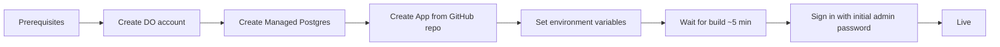
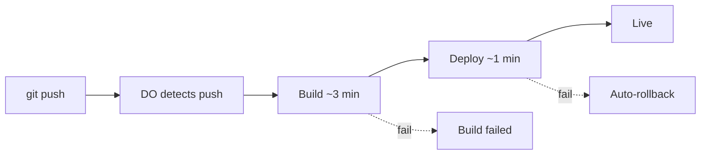

# DigitalOcean Production Setup

A complete, step-by-step guide for getting Furnish Hope running on
the internet using DigitalOcean. **Written for non-technical
nonprofit staff** — no coding background assumed. Every step lists
what to click, what to type, and what you should see when it works.

## What you'll have when you're done

A web address (something like `yourorg-app-XXXXX.ondigitalocean.app`)
that any staff member can open in a browser and use, with:

- A live web app that anyone with an account can sign in to
- A managed PostgreSQL database that DO backs up automatically
- Automatic redeployment whenever code is pushed to GitHub

## How much it costs

About **$20/month** for the entry tier (App + small Postgres). You
can grow that later as the org scales without redoing setup. Pay
with a credit card; DO charges monthly.

| Component | Tier | Cost |
|-----------|------|------|
| App Platform | Basic ($5 plan) | ~$5/mo |
| Managed Postgres | Dev DB | ~$15/mo |
| **Total** | | **~$20/mo** |

## How long it takes

**45–90 minutes** the first time. After that, deployments are
hands-off — push code, wait a few minutes.

---

## Before you start

You need these things ready:

1. **A credit card** for the DigitalOcean account.
2. **A GitHub account** with the Furnish Hope code pushed to a repo.
   If you don't have this yet, do [Windows](SETUP_DEV_WINDOWS.md) or
   [Mac](SETUP_DEV_MAC.md) developer setup first — those walk you
   through cloning the code and pushing it to your own repo.
3. **An email address** to receive DO account confirmation and alerts.
4. **About an hour** of uninterrupted time.



---

## Step 1 — Create a DigitalOcean account (5 min)

1. Open a browser. Go to <https://www.digitalocean.com>.
2. Click the orange **Sign Up** button at the top right.

   > **🖼️ What you'll see:** The DigitalOcean home page with marketing
   > graphics and a prominent "Sign Up" button. Don't get distracted
   > by the marketplace links.

3. Choose **Sign up with email** (or use Google/GitHub if you prefer
   — all work).
4. Fill in your email, set a strong password, click **Create account**.
5. Check your email for a confirmation link. Click it.
6. Back on DO, you'll be asked for:
   - **Team name** — type your organization name (e.g.
     "Furnish Hope"). This shows up at the top of every DO page.
   - **Use case** — pick "Application hosting" or "Web hosting".
   - **Payment** — enter a credit card. DO will charge $0 today; the
     first real bill comes at the end of the calendar month.

> **🛟 What if the signup form looks different?** DO redesigns
> their interface occasionally. The general flow is always:
> email → confirm → team name → payment. Look for buttons labeled
> "Continue", "Next", or "Skip" to move through the screens.

When you're done you'll land on the **DigitalOcean Cloud** dashboard —
a sidebar on the left with **Projects, Apps, Databases, …** and a main
panel that's mostly empty until you create something.

---

## Step 2 — Create a Managed Postgres database (10 min)

Furnish Hope stores all its data (clients, donations, inventory,
etc.) in a PostgreSQL database. DO's "Managed Databases" service
runs it for you with automatic backups.

1. In the left sidebar, click **Databases**.
2. Click the green **Create Database Cluster** button at the top.

   > **🖼️ What you'll see:** A configuration page with five sections —
   > Engine, Plan, Region, Cluster name, Project.

3. Fill in the page:

   | Field | Value |
   |-------|-------|
   | **Database Engine** | PostgreSQL — pick the **latest version** offered (16, 17, or whatever's current). |
   | **Plan** | **Basic** with a single node and the smallest tier (1 GB RAM / 1 vCPU / 10 GB disk, ~$15/mo). |
   | **Region** | **San Francisco** or **New York** — whichever is geographically closer to your team and donors. |
   | **Cluster name** | `furnish-hope-db` |
   | **Project** | Leave at the default ("first-project" or similar). |

4. Click the green **Create Database Cluster** button at the bottom.

   > **⏱️ How long:** about 4 minutes. The page will show a spinning
   > "Creating database…" message. Don't close the browser tab; just
   > wait for it to finish.

5. When it's done you'll see the cluster's **Overview** page. Take
   note of the connection details — but you don't need to copy them
   manually, DO will wire them into the app for you in Step 4.

> **🛟 If your database creation hangs longer than 10 minutes:**
> click the cluster name in the Databases list. If status is "in
> progress" with no error, just keep waiting. If status shows an
> error message, click **Destroy** and try again with a different
> region.

---

## Step 3 — Create the App from your GitHub repo (15 min)

The "App" is the web service that serves the website. DO will read
the code from GitHub and rebuild whenever you push.

### 3.1 Authorize GitHub access

1. In the left sidebar, click **Apps**.
2. Click the green **Create App** button.
3. **Source** screen: click **GitHub**.

   > **🖼️ What you'll see:** Three big buttons — GitHub, GitLab,
   > Container Registry. Pick GitHub.

4. A popup opens asking you to install **DigitalOcean** on your
   GitHub account.
   - Sign in to GitHub if you're not already.
   - Choose **Only select repositories** (safer than "All repositories").
   - Pick the `furnish-hope` repo from the dropdown.
   - Click **Install & Authorize**.
5. Back on DO, the GitHub source screen now lets you pick a repo.

### 3.2 Pick the repo and branch

| Field | Value |
|-------|-------|
| **Repository** | Your `furnish-hope` repo |
| **Branch** | `main` |
| **Autodeploy** | Leave checked (this is the magic — pushing to GitHub triggers a rebuild) |
| **Source Directory** | `/` (the root) |

6. Click **Next**.

### 3.3 Confirm the resources

DO scans your repo and detects a Node.js service. It should show:

| Detail | Expected value |
|--------|----------------|
| **Type** | Web Service |
| **Run command** | `npm start` |
| **Build command** | `npm run build` |
| **HTTP port** | `8080` (or DO's default; matches what `index.ts` reads from `process.env.PORT`) |

If anything looks off, click **Edit** on that row and fix it. Then
click **Next**.

> **🛟 If DO detects two services** ("api" and "web" as separate
> resources): combine them. The Furnish Hope repo is a single
> service that serves both. You should have ONE resource named
> something like "furnish-hope" or "web". Delete any extras.

### 3.4 Set the resource plan

| Field | Value |
|-------|-------|
| **Plan** | **Basic** |
| **Instance size** | The smallest available (~$5/mo) — usually labeled "Basic XXS" or "512 MB RAM". You can upgrade later. |
| **Container count** | 1 |

Click **Next**.

### 3.5 Environment variables

This is the most important page. The app reads sensitive settings
from environment variables.

| Variable name | Value | Type |
|---------------|-------|------|
| `NODE_ENV` | `production` | Plain |
| `SESSION_SECRET` | A long random string (see below) | **Encrypted** |
| `SESSION_SECURE` | `true` | Plain |
| `WEB_ORIGIN` | `https://your-app-name.ondigitalocean.app` (you'll get this URL after the first deploy — set as a placeholder for now) | Plain |
| `ATTACHMENT_ENCRYPTION_KEY` | Another long random string | **Encrypted** |

**How to generate a random string for `SESSION_SECRET`:**

- On a Mac terminal: `openssl rand -hex 32`
- On Windows PowerShell:
  `-join ((48..57) + (65..90) + (97..122) | Get-Random -Count 64 | % { [char]$_ })`
- Or use an online generator like <https://generate-secret.vercel.app/64>
  (paste the result; never reuse the same value across deployments).

Click **Encrypt** next to the value field before saving any
sensitive variable. Encrypted variables can't be read back from the
DO UI — only the app can decrypt them at runtime.

> **🖼️ What you'll see:** Each row has a Name field, Value field,
> Scope dropdown, and an "Encrypt" toggle. Keep scope as
> "Component-level" (the default).

Click **Next**.

### 3.6 Attach the database

1. You'll see a "Databases" section. Click **Attach Database**.
2. Pick `furnish-hope-db` from the dropdown.
3. DO will automatically inject `DATABASE_URL` and related
   environment variables into the app — you don't have to set
   them manually.

Click **Next**.

### 3.7 Final review

| Field | Value |
|-------|-------|
| **App name** | `furnish-hope` (or a name you prefer) |
| **Project** | Leave at default |
| **Region** | Pick the SAME region as your Postgres cluster from Step 2 |

Click **Create Resources** at the bottom.

> **⏱️ How long:** the first build takes 4–8 minutes. You'll watch
> a streaming build log: dependency install → web build → app
> startup. Don't refresh the page.

When the build is done you'll see a green "Deployed" status and a
URL at the top — something like
`furnish-hope-XXXXX.ondigitalocean.app`. That's your live site.

---

## Step 4 — Get the initial admin password (5 min)

Furnish Hope creates an initial admin account on first startup and
prints the temporary password to the deploy log.

1. On your app's page, click the **Runtime Logs** tab (or **Console**
   if there's no Runtime Logs tab).
2. Look for a banner that says:

   ```
   ************************************************************************
   INITIAL ADMIN ACCOUNT CREATED
     Username: admin
     Temporary password: cas-mor-len-417
     CHANGE THIS PASSWORD on first login.
   ************************************************************************
   ```

   **Copy the temporary password.** You only get one chance — DO log
   retention is typically a few days, so do this within a week.

3. Open the app URL in a new browser tab.
4. Sign in with username `admin` and the temporary password.
5. **Immediately** click your name in the bottom-left corner →
   change your password to something only you know.

> **🛟 If you missed the password in the logs:** sign into the DO
> Postgres console (Database → Connection Details → "Open Console")
> and reset it with SQL:
>
> ```sql
> -- Generate a new bcrypt hash on a developer machine first:
> -- node -e "console.log(require('bcrypt').hashSync('new-password', 10))"
> UPDATE tbl_user_account
>    SET password_hash = '<that-hash>'
>  WHERE username = 'admin';
> ```

---

## Step 5 — Pin down the public URL (5 min)

DO assigns a generated URL on first deploy. If you want a custom
domain like `app.furnishhope.org`, do this now.

1. Click your app name to go to its dashboard.
2. Click the **Settings** tab.
3. Scroll to **Domains** and click **Edit**.
4. Click **Add Domain**.
5. Type your domain (e.g. `app.furnishhope.org`) and click **Add**.
6. DO shows you a DNS record to add at your domain registrar
   (typically a CNAME).
7. Go to your domain registrar (GoDaddy, Cloudflare, Namecheap, etc.)
   and add the CNAME record exactly as shown.
8. Back on DO, click **Refresh** until the domain shows green
   "Verified". DNS can take up to an hour to propagate.

After verification:

- Update the `WEB_ORIGIN` environment variable to point at your
  custom domain.
- Redeploy the app (Apps → your app → **Settings → App-Level
  Environment Variables → Save**, which triggers a redeploy).

---

## Day-to-day operations

Once everything is set up, your main interactions with DO are:

### Watch a deploy

Each `git push` to `main` automatically triggers a rebuild. To
watch one:

1. Sidebar → **Apps** → click your app.
2. Click the **Activity** tab.
3. Find the most recent deployment (top of the list). Click it.
4. Watch the streaming log. Done in 3–5 minutes.



### Check the app's health

The app exposes `/api/health` which returns `{ok:true}` if it's up.
Just visit `https://your-url/api/health` in a browser. You should
see `{"ok":true}`.

### View logs

App → **Runtime Logs** shows the last few thousand lines of
console output. Useful when something goes wrong.

### Back up the database

DO Managed Postgres takes automatic daily backups. To do a manual
one before a risky change:

1. Sidebar → **Databases** → click `furnish-hope-db`.
2. Click the **Backups** tab.
3. Click **Backup Now**. Done in a minute.

### Restore from backup

1. Same Backups tab.
2. Pick a backup → click the three-dot menu → **Restore**.
3. Confirm in the popup. DO will create a NEW cluster from that
   backup — the old one keeps running until you swap them.

### Scale up

Going from 5 staff to 50 staff? Click the app → **Settings → App Spec**
and bump the instance size. Same for the database. Both scale
without downtime.

---

## Troubleshooting

### "Build failed" on the Activity tab

Click into the failed deployment and read the error message at the
bottom of the log. Common causes:

| Error | Fix |
|-------|-----|
| `npm ERR! ELIFECYCLE` | A `npm install` failure. Re-run the dev setup locally and check for missing dependencies before pushing again. |
| `error TS####` | A TypeScript error. Run `npx tsc --noEmit` locally in both `api/` and `web/` before pushing. |
| `Cannot find module '…'` | A file you renamed or deleted is still referenced somewhere. Search the codebase for the old name. |

### "App is up but I can't sign in"

- Confirm the database actually got attached: app **Settings →
  Components → your component → Environment Variables**. You
  should see `DATABASE_URL` (encrypted, auto-injected by DO).
- Check Runtime Logs for the "INITIAL ADMIN ACCOUNT CREATED" banner.
  If it never appeared, the migrations probably failed; the log
  will show why.

### "DATABASE_URL is undefined"

You forgot to attach the Postgres cluster in step 3.6. App →
**Settings → Resources → Add Database → furnish-hope-db**. The
app will redeploy.

### "I can't push to GitHub anymore"

This is a GitHub problem, not a DO problem. See your developer
setup guide ([Windows](SETUP_DEV_WINDOWS.md) or
[Mac](SETUP_DEV_MAC.md)) → Troubleshooting.

### Costs are higher than $20/month

Things that can drive cost up:

- You created multiple App copies (e.g. one per branch). Delete
  the ones you're not using.
- The Postgres cluster scaled itself up. Go to the cluster
  **Settings** and confirm the plan is still the Basic dev tier.
- DO added new line items (Spaces for file storage, etc.). Check
  the **Billing** section of the dashboard to itemize.

---

## When this guide gets out of date

Setup docs drift fast — DO redesigns their UI, new env vars get
added, prerequisites change. If you follow a step and what you
see doesn't match what's written:

1. Note the divergence (which step, what was different).
2. Use the **Report Issue** button in the running app (top right
   of any admin page) with a screenshot. The developer will see it.
3. Or open this file (`docs/SETUP_DIGITAL_OCEAN.md`) and submit a
   correction directly.

This doc is kept in sync with the actual deployment process as
part of the codebase. If you spot something stale, it's a bug.
